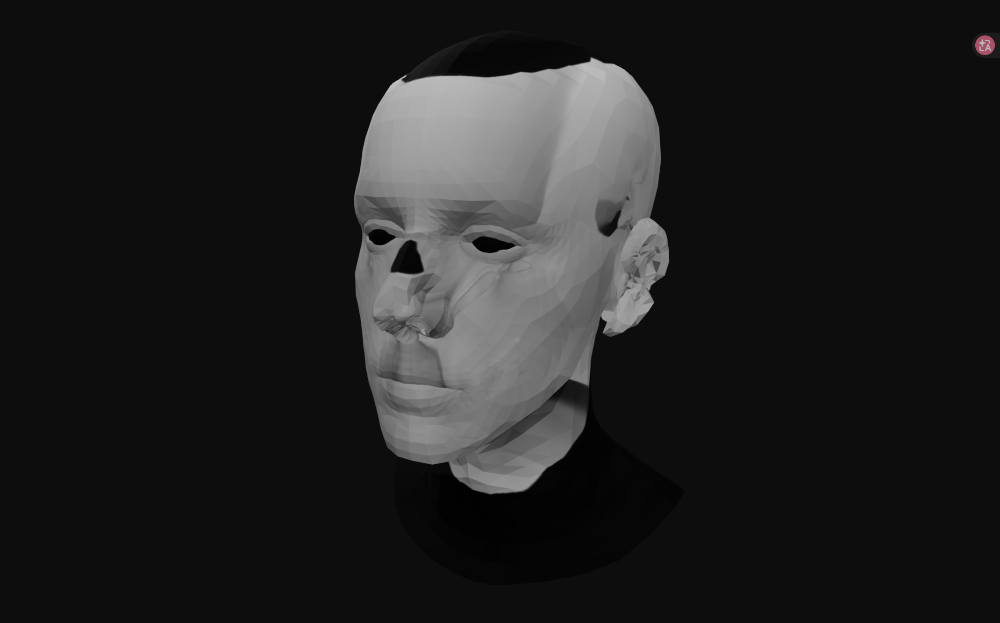
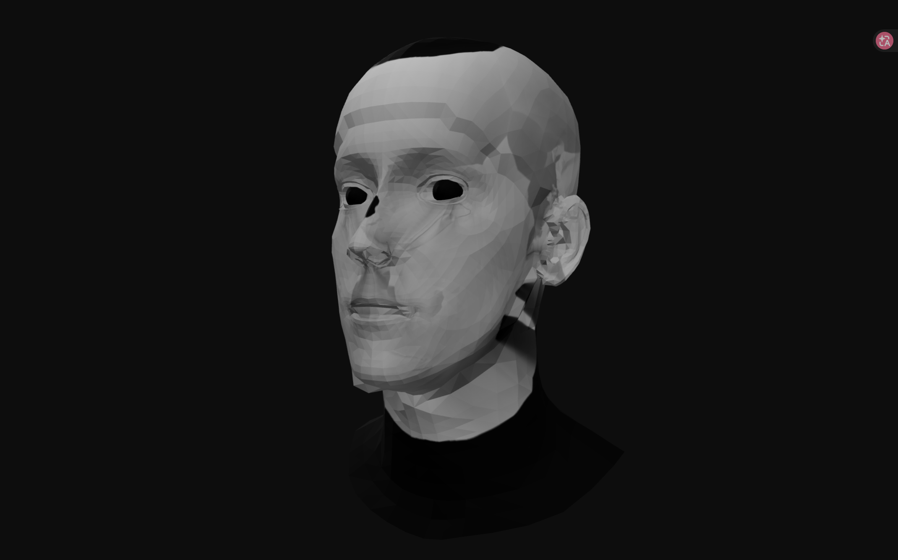
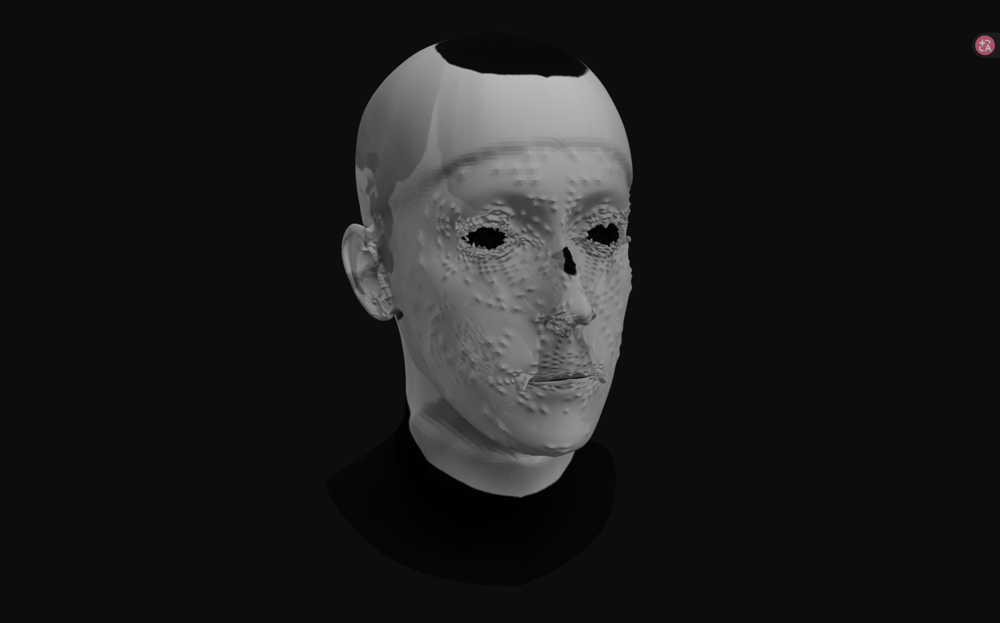
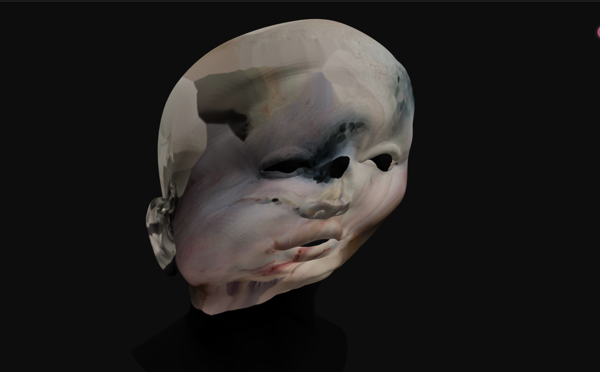
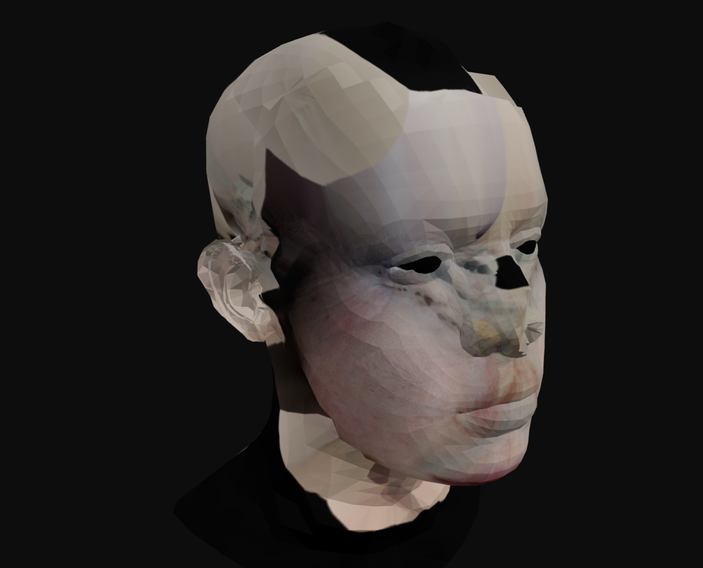
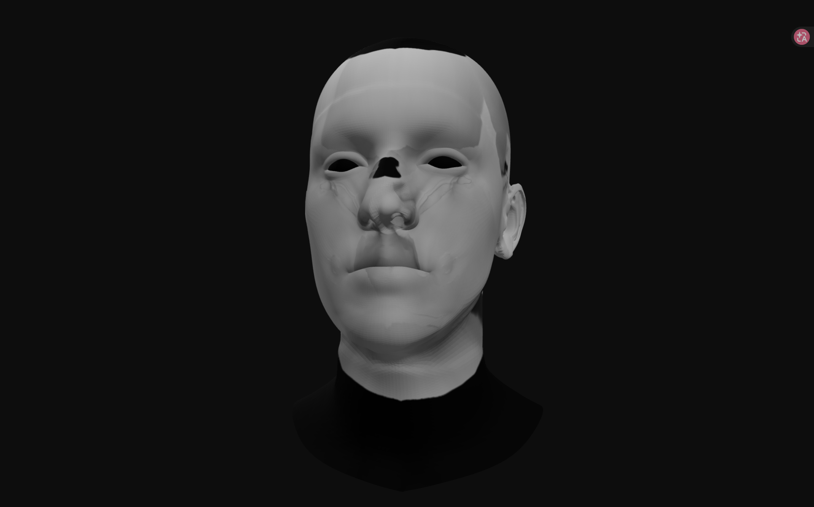

# Face3D 技术方案总结

> 医美级高保真 3D 人脸重建与皮肤分析系统  
> 截止日期：2026-04-10  
> 已完成 28 次端到端 Session 测试

---

## 1. 系统总览

### 1.1 项目目标

通过三个固定角度（正脸、左侧 45°、右侧 45°）的 2D 照片，快速构建具有物理级精度和照片级皮肤纹理的 3D 人脸模型，最终输出标准 GLB 文件供前端 Three.js 交互查看。

### 1.2 系统架构

```
输入图像 (3张)
    │
    ├─ Module 0: 相机内参预测
    ├─ Module 1: 数据预处理（关键点 + 分割）
    ├─ Module 1b: 三视角纹理预融合（可选）
    ├─ Module 2: 3DMM 几何重构（FLAME + 深度置换）
    ├─ Module 3: 纹理烘焙 + GLB 打包
    │
    └─ API 层：FastAPI + WebSocket 进度推送
         └─ 前端：Three.js GLB 查看器
```

### 1.3 技术栈

| 维度 | 工具 |
|------|------|
| 语言 | Python 3.10+, TypeScript |
| 深度学习 | PyTorch |
| 人脸先验 | FLAME 2020 (5023 顶点, 9976 面片) |
| 关键点 | MediaPipe Face Mesh (468点) + face_alignment (68点) |
| 深度估计 | Depth-Anything-V2 (Large) |
| 3D 处理 | trimesh, Open3D, SciPy |
| 后端 | FastAPI + SQLite (aiosqlite) |
| 前端 | Three.js / GLB Viewer |

---

## 2. 各模块技术方案与测试指标

---

### Module 0: 相机内参预测 (`module0_intrinsics.py`)

**功能**：估计每张输入图像的相机内参矩阵 K (3x3)。

**技术方案**（三级 fallback）：
1. **手动提供**：`config.MANUAL_INTRINSICS` 直接构建 K 矩阵
2. **Dust3R 预测**：使用 `DUSt3R_ViTLarge_BaseDecoder_512_dpt` 自动估计焦距和主点
3. **经验估计**：假设水平 FOV=50°，由图像尺寸反推 `fx = (w/2) / tan(fov/2)`

**当前状态**：使用手动内参 `fx=fy=1200, cx=cy=256`（匹配 512x512 缩放后图像）

**测试指标**：

| 指标 | 预期值 | 当前状态 |
|------|--------|----------|
| K 矩阵数值稳定性 | 无 NaN/Inf | 通过 |
| 多视角内参一致性 | 同一设备共享 K | 通过（手动模式） |
| Dust3R 焦距误差 | < 10% | 未启用（Dust3R 未安装） |

---

### Module 1: 数据预处理 (`module1_preprocess.py`)

**功能**：
1. 加载 3 张图像（左/正/右），统一缩放到 512x512（等比 + 黑边填充）
2. MediaPipe Face Mesh 检测 468 个 2D 关键点
3. 纯黑背景分割 + 面部轮廓 Mask 生成
4. 输出调试可视化图

**关键参数**：
- `min_detection_confidence = 0.3`（降低阈值提高闭眼/侧脸鲁棒性）
- `max_size = 960`（内部缩放加速检测）
- `morph_kernel = 15`（形态学操作核大小）
- 面部轮廓使用 MediaPipe FACE_OVAL 索引（36 个点）+ 25px 膨胀

**测试指标**：

| 指标 | 预期值 | 当前状态 |
|------|--------|----------|
| 关键点检测成功率 | 3/3 视角均检测到 | 通过（闭眼场景下正常检测） |
| 关键点数量 | 468 点/视角 | 通过 |
| Face Mask 覆盖率 | 面部区域 > 95% | 通过 |
| 背景分割准确率 | 纯黑背景 > 99% | 通过 |
| 缩放后内参一致性 | cx=cy=256 居中 | 通过 |

**调试输出示例**：

正面关键点检测（468 点绿色叠加）：


正面 Face Mask 叠加效果（暗区为 mask 外区域）：


Mesh 投影到正面图像（红色点 = FLAME 顶点投影）：


---

### Module 1b: 三视角纹理预融合 (`module1b_texture_fusion.py`)

**功能**：在三维建模之前，将三张视角图像融合成一张颜色统一的正面纹理。

**技术方案**：
1. **Reinhard 颜色迁移**：逐通道统计（均值+标准差），将 left/right 色调对齐到 front
2. **TPS 薄板样条变形**：基于 468 个 MediaPipe 关键点，用 `RBFInterpolator(thin_plate_spline)` 计算逆映射
3. **软边界加权混合**：距离变换权重（front 额外 +0.5 底座保持主导），sigma_front=40, sigma_side=25
4. **Face mask 裁剪**：仅保留面部区域，背景填黑

**当前状态**：pipeline_runner 中已作为 fallback 保留，高清直采模式下跳过此模块。

**测试指标**：

| 指标 | 预期值 | 当前状态 |
|------|--------|----------|
| 颜色一致性 | 三视角色差 < 5 (Lab ΔE) | 基本通过 |
| TPS 变形对齐 | 关键点对齐误差 < 3px | 通过 |
| 边界过渡自然度 | 无可见拼接线 | 基本通过 |

**调试输出示例**（Session 28）：

融合后的统一纹理：


---

### Module 2: 3DMM 几何重构 (`module2_geometry.py`)

**功能**：核心模块，完成从 2D 关键点到 3D Mesh 的重建。

**技术方案分步**：

#### Step 1: 初值估计
- **DECA**（优先）：单图推理得到 FLAME 参数（shape/exp/pose/cam）
- **face_alignment**（fallback）：检测 68 个 3D 关键点，用 PnP 估计初始 R/t
- PnP 使用 `cv2.solvePnPRansac`（ITERATIVE 模式，reprojectionError=8.0）
- 退化检测：`t_z ≤ 0.05` 时回退到基于人脸尺寸的深度估计

#### Step 2: L-BFGS 联合优化
- **共享参数**：shape α（300维，所有视角共用同一脸型）
- **独立参数**：每视角的 exp β（100维）、rvec（3维轴角）、t（3维平移）
- **损失函数**：`Σ_v ||proj(FLAME(α,β_v), K_v, R_v, t_v)[lmk_bary] - lmk_2d_v||² + λ_shape||α||² + λ_exp||β||²`
- Landmark 使用重心坐标插值（精度高于单顶点索引）
- 归一化坐标（/1000）降低数值问题
- 梯度裁剪 `max_norm=1.0` 防止 NaN
- 外层 10 步迭代，每步内 L-BFGS max_iter=100，lr=0.05

#### Step 3: Loop Subdivision
- FLAME 基础 Mesh (5023 顶点, 9976 面片) → 2 次 Loop 细分 → ~20K 顶点, ~40K 面片
- UV 同步线性细分（保证几何-UV 面片一一对应）

#### Step 4: Depth-Anything-V2 深度置换
- 多视角融合方案：每视角独立估计深度 → 尺度对齐 → 加权融合
- **尺度对齐**：稀疏版最小二乘 `d_aligned = s * d_pred + t ≈ d_cam`
- **权重**：`w = feather_mask × cos(normal, view_dir)`（法线可见度 × 边缘衰减）
- **位移**：`disp = clip(d_pred_at_v - z_cam, -max_disp, +max_disp)`，沿顶点法线方向
- `max_displacement = 0.002m`，双边滤波 `d=9, σ_color=0.08, σ_space=15`

#### Step 5: Mesh 导出
- 输出 `.obj` 文件（顶点 + UV + 法线 + 面片）
- 同时保存 `cameras.json`（各视角 K/R/t）

**关键超参数**：

| 参数 | 值 | 含义 |
|------|-----|------|
| N_SHAPE_PARAMS | 300 | FLAME 形状参数维度 |
| N_EXP_PARAMS | 100 | FLAME 表情参数维度 |
| LAMBDA_SHAPE | 5e-4 | 形状正则化权重 |
| LAMBDA_EXP | 5e-4 | 表情正则化权重 |
| LBFGS_MAX_ITER | 100 | L-BFGS 内层最大迭代 |
| LBFGS_LR | 0.05 | L-BFGS 学习率 |
| DISPLACEMENT_SCALE | 0.002 | 最大顶点置换幅度（米） |
| SUBDIV_ITERS | 2 | Loop Subdivision 迭代次数 |

**测试指标**：

| 指标 | 预期值 | 当前状态 |
|------|--------|----------|
| L-BFGS 收敛 | loss < 1e-5 (归一化) | 通过（通常 3-5 步收敛） |
| PnP 成功率 | > 90% | 通过 |
| 关键点重投影误差 | < 5px (512x512) | 通过 |
| 深度对齐 RMSE | < 0.01m | 通过 |
| Mesh 面片数（细分后） | ~40K | 通过（~40K faces） |
| 无 NaN 输出 | 100% | 通过 |

**调试输出示例**：

Depth-Anything-V2 深度预测图（亮=近，暗=远）：


深度对齐后结果（与 3DMM 渲染深度对比）：


---

### Module 3: 纹理烘焙 + GLB 打包 (`module3_texture.py`)

**功能**：将照片颜色映射到 3D Mesh 的 UV 纹理图，打包为标准 GLB 格式。

**技术方案**：

#### 纹理烘焙（三种模式，按优先级）

**模式 1：高清直采（当前默认）**
- 直接使用原始高清正面照片投影到 UV 空间
- K 矩阵按 `scale_factor = max(原图尺寸) / 512` 缩放
- 法线可见性剔除（`cos > 0.05`），排除后脑/侧面
- Face mask 过滤背景/支架
- 亮度过滤（`brightness > 20`），排除暗背景
- 多尺度 Inpainting 填充遮挡区域：
  1. 计算平均肤色作为填充基底
  2. 1/8 缩放做 TELEA inpaint（传播大范围颜色梯度）
  3. 上采样回原尺寸替换空洞
  4. 原尺寸细化修复边界锯齿

**模式 2：预融合统一纹理**
- 使用 Module 1b 融合后的正面纹理做单视角投影

**模式 3：多视角直接烘焙**
- 余弦平方权重 `w = max(0, cos(normal, view_dir))²`
- 加权混合三张照片颜色
- 泊松接缝修复（LAB 色差 > 30 的区域做 inpaint）

#### UV 光栅化
- 分辨率：2048x2048
- 逐三角形扫描线光栅化 + 重心坐标计算
- 双线性采样颜色

#### GLB 打包
- Laplacian 平滑（2 次，λ=0.3）
- Per-face-vertex UV 展开（独立 UV 寻址）
- 重算平滑顶点法线
- PBR 材质（metallicFactor=0, roughnessFactor=0.9）
- 可选 Draco 压缩（减少 5-10x 体积）
- extras 元数据携带图层信息（前端切换用）

**测试指标**：

| 指标 | 预期值 | 当前状态 |
|------|--------|----------|
| 纹理分辨率 | 2048x2048 | 通过 |
| UV 有效覆盖率 | > 60% | 通过 |
| 正面面部着色率 | > 80% UV 像素 | 基本通过（~70-80%） |
| Inpainting 无黑斑 | 有效区域无纯黑 | 通过 |
| GLB 文件大小 | < 20MB | 通过（3.5-18MB） |
| Three.js 加载 | 正常渲染 | 通过 |

**纹理烘焙输出示例**：

早期多视角纹理（有色差拼接问题）：


最新 Session 28 纹理（高清直采，灰度测试数据）：


---

### API 层 (`src/api/`)

**功能**：提供 RESTful API + WebSocket 进度推送。

**端点**：

| 方法 | 路径 | 功能 |
|------|------|------|
| POST | `/api/sessions` | 上传图片，创建重建会话 |
| GET | `/api/sessions` | 列出所有会话（时间倒序） |
| GET | `/api/sessions/{id}` | 查询单个会话详情 |
| GET | `/api/sessions/{id}/model` | 下载 GLB 文件 |
| DELETE | `/api/sessions/{id}` | 删除会话及文件 |
| POST | `/api/calibration` | 提交手动相机内参 |
| WS | `/ws/{session_id}` | 进度推送 |

**进度推送协议**：

```json
{"stage": "loading",    "pct": 5,   "message": "加载图像..."}
{"stage": "intrinsics", "pct": 10,  "message": "计算相机内参..."}
{"stage": "landmarks",  "pct": 20,  "message": "检测面部关键点..."}
{"stage": "fitting",    "pct": 30,  "message": "3DMM 几何拟合中..."}
{"stage": "depth",      "pct": 65,  "message": "深度估计完成"}
{"stage": "texture",    "pct": 75,  "message": "高清纹理烘焙中..."}
{"stage": "done",       "pct": 100, "message": "重建完成", "glb_path": "..."}
```

**测试指标**：

| 指标 | 预期值 | 当前状态 |
|------|--------|----------|
| 端到端重建成功 | 图像上传→GLB 产出 | 通过（28 次 Session） |
| WebSocket 进度推送 | 实时百分比更新 | 通过 |
| 错误处理 | 异常不崩溃，返回 error stage | 通过 |
| 并发 Session | 支持多会话隔离 | 通过 |

---

## 3. 端到端重建效果演进

### 3.1 早期版本（Session 1-5）：多视角直接烘焙

几何拟合基本正确，但纹理存在明显的多视角色差拼接问题，眼部/鼻孔区域有黑洞。

正面视角（低面片数，色差可见）：



侧面视角：



### 3.2 中期版本（Session 6-14）：Subdivision + 深度置换

引入 Loop Subdivision 增加几何精度，深度置换增加面部细节，但纹理仍有斑驳问题。

深度置换后效果（纹理异常放大）：



多视角纹理色差问题：



### 3.3 近期版本（Session 20+）：高清直采 + 多视角融合置换

几何精度显著提升（多视角融合深度置换），纹理采用高清正面直采消除色差。

当前最新 GLB 渲染效果：



灰度模式下几何细节（无纹理干扰）：



---

## 4. 已知问题与待优化项

### 4.1 纹理问题（优先级：高）

| 问题 | 描述 | 影响 |
|------|------|------|
| 眼部/鼻孔黑洞 | 这些凹陷区域法线背对相机，投影失败 | 正面外观 |
| 高清直采单视角局限 | 侧面/耳后区域仅靠 Inpainting 填充 | 侧面真实度 |
| 色彩保真度 | 灰度测试数据，彩色效果待验证 | 整体视觉 |

### 4.2 几何问题（优先级：中）

| 问题 | 描述 | 影响 |
|------|------|------|
| 深度置换噪声 | Depth-Anything 高频噪点可能放大 | 面部平滑度 |
| 眼球/口腔缺失 | FLAME 不含眼球/牙齿模型 | 真实度 |
| 侧脸拟合精度 | 侧脸关键点精度低于正面 | 侧面几何 |

### 4.3 系统问题（优先级：低）

| 问题 | 描述 | 影响 |
|------|------|------|
| Dust3R 未集成 | 相机内参依赖手动输入 | 灵活性 |
| DECA 未集成 | 初值依赖 face_alignment | 拟合精度 |
| 重建耗时 | 约 60-120 秒（GPU） | 用户体验 |

---

## 5. 预期效果指标总表

| 维度 | 目标指标 | 当前达成 | 差距 |
|------|----------|----------|------|
| 纹理分辨率 | >= 2K (2048x2048) | 2048x2048 | 达标 |
| 几何面片数 | >= 40K | ~40K (2次Loop细分) | 达标 |
| 色斑/毛孔位置偏移 | < 1mm | 未量化测试 | 待验证 |
| 重建耗时 | 30-60 秒 | 60-120 秒 | 需优化 |
| GLB 文件大小 | < 20MB | 3.5-18MB | 达标 |
| Web 720° 旋转查看 | 流畅 | Three.js 基础查看器 | 达标 |
| 多模式切换 | 白光/UV/红区 | 仅白光 | 待开发 |
| 皮肤诊断分析 | 色沉/红区/皱纹 | 未实现 | 阶段四 |

---

## 6. 文件结构

```
face3D/
├── src/
│   ├── config.py                 # 全局配置（路径、超参数）
│   ├── module0_intrinsics.py     # 相机内参预测
│   ├── module1_preprocess.py     # 数据预处理（关键点 + 分割）
│   ├── module1b_texture_fusion.py # 三视角纹理预融合
│   ├── module2_geometry.py       # 3DMM 几何重构（FLAME + 深度置换）
│   ├── module3_texture.py        # 纹理烘焙 + GLB 打包
│   └── api/
│       ├── app.py                # FastAPI 服务端点
│       ├── db.py                 # SQLite 数据库
│       ├── models.py             # ORM 模型
│       └── pipeline_runner.py    # 后台流水线执行器
├── frontend/                     # Three.js 前端查看器
├── models/
│   ├── FLAME/                    # FLAME 2020 模型权重
│   └── depth_anything/           # Depth-Anything-V2 权重
├── external/
│   ├── DECA/                     # DECA（可选）
│   └── dust3r/                   # Dust3R（可选）
├── output/
│   ├── debug/                    # 调试可视化输出
│   ├── meshes/                   # Mesh + cameras.json
│   ├── textures/                 # 纹理贴图
│   └── sessions/                 # 各 Session 独立输出
└── FLAME2020/                    # FLAME 原始数据
```
